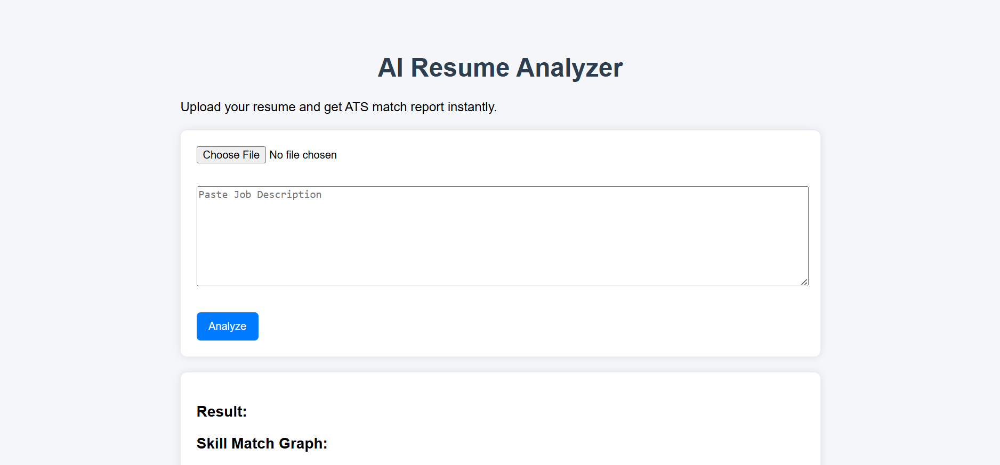

# 🧠 Resume Analyzer & Job Match System

An web application that analyzes resumes against job descriptions, calculates match scores, identifies missing skills, provides improvement suggestions, visualizes skill gaps, and generates downloadable PDF reports.

---

## 🚀 Live Demo

🔗 **Live Website:** https://YOUR_RENDER_LINK  
📂 **GitHub Repo:** https://github.com/YOUR_USERNAME/ai-resume-analyzer  

---

## 📌 Features

### ✅ Core Features
- Upload resume in PDF format
- Paste job description for comparison
- NLP-based resume–job matching
- Skill extraction from resume and job description
- Missing skill detection
- Job role recommendation

### 📊 Visualization
- Skill match bar graph visualization using Matplotlib

### 📄 Report Generation
- Automatically generates a professional downloadable PDF report containing:
  - Match score
  - Extracted skills
  - Missing skills
  - AI improvement tips
  - Recommended job role
  - Skill match graph

---

## Demo Screenshots
(Add screenshots here) 

---

## 🧠 Tech Stack

| Category | Technology |
|----------|------------|
| Backend | FastAPI, Python |
| NLP | spaCy, TF-IDF (Scikit-learn) |
| PDF Parsing | pdfplumber |
| Visualization | Matplotlib |
| PDF Report | ReportLab |
| Frontend | HTML, CSS, JavaScript |
| Deployment | Render |
| Version Control | Git & GitHub |

---

## ⚙️ How It Works

1. User uploads a resume PDF.
2. User pastes a job description.
3. The system extracts text from the resume.
4. NLP techniques extract technical skills.
5. TF-IDF cosine similarity calculates match score.
6. Missing skills are identified.
7. AI tips are generated for resume improvement.
8. Skill match graph is created.
9. A professional PDF report is generated for download.

---

## 🖥️ How to Run Locally

### 1️⃣ Clone the Repository
bash
git clone https://github.com/YOUR_USERNAME/ai-resume-analyzer.git
cd ai-resume-analyzer

### 2️⃣ Install Dependencies
pip install -r requirements.txt

### 3️⃣ Download spaCy Model
python -m spacy download en_core_web_sm

### 4️⃣ Run the Server
uvicorn app:app --reload

### 5️⃣ Open in Browser
http://127.0.0.1:8000

---

## ☁️ Deployment on Render
Build Command
pip install -r requirements.txt

Start Command
uvicorn app:app --host 0.0.0.0 --port 10000

---

## 📄 Sample Output
JSON API Output
{
  "score": 72.5,
  "resume_skills": ["python", "sql", "machine learning"],
  "job_skills": ["python", "sql", "react", "fastapi"],
  "missing_skills": ["react", "fastapi"],
  "tips": ["Consider learning React", "Consider learning FastAPI"],
  "recommended_job": "Software Engineer"
}

Generated PDF Report Includes

- Resume Match Score

- Skills Found

- Missing Skills

- Resume Improvement Tips

- Recommended Job Role

- Skill Match Graph

---

## 🧠 Future Enhancements

- React-based dashboard UI

- ATS score gauge meter

- Radar skill chart visualization

- User authentication & resume history tracking

- GPT-based resume improvement chatbot

- Real-time job scraping from LinkedIn/Naukri

- Cloud database (MongoDB / Supabase)

- Dockerized deployment

- Chrome extension for ATS scoring on job portals